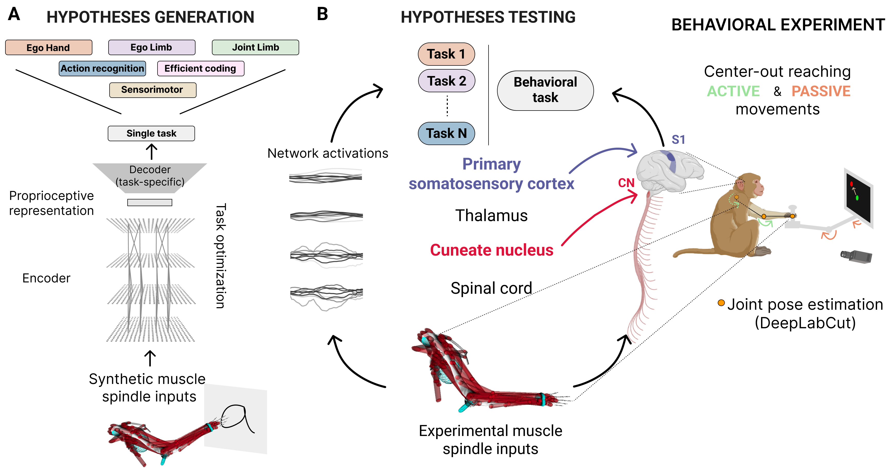

<h1 style="text-align: center;">Task-driven neural network models predict neural dynamics of proprioception.</h1>

<h2>Overview</h2>

We created a normative framework to study the neural dynamics of proprioception. Using synthetic muscle spindle input inferred via musculoskeletal modeling, we optimized neural networks to solve 16 computational tasks to test multiple hypotheses, each representing different hypotheses of the proprioceptive system. We contrasted these different hypotheses by using neural networks' internal representations to predict the neural activity in proprioceptive brain areas (cuneate nucleus and primary somatosensory cortex) of primates performing a reaching task.
Importantly, the models were not trained to directly predict the neural activity but were linearly probed at test time. To fairly compare different computational tasks, we kept fixed the movement statistics and the neural network architectures.

<p align="center">
    
</p>

We found that:
- network’s internal representations developed through task-optimization generalize from synthetic data to predict single-trial neural activity in proprioceptive brain areas outperforming linear and data-driven model.
- neural networks trained to predict the limb position and velocity can better predict the neural activity in both areas with the neural predictability correlated with the network's task performance.
- task-driven models can better predict neural activity than untrained models only for active movements, but not for passive ones, suggesting there might be a top-down modulation during goal-directed movements.

Check out our manuscript, if you want to learn more: [Task-driven neural network models predict neural dynamics of proprioception](https://www.biorxiv.org/content/10.1101/2023.06.15.545147v1.full.pdf). 

Here we share the code to reproduce the results. Please note that the code was developed and tested in Linux (see: [Installation, software & requirements](#installation)).

<h2>Structure of the code.</h2>

The code is organized into subtasks of the whole pipeline as follows:

- [PCR-data-generation](PCR-data-generation) contains code for creating the PCR dataset using a NHP musculoskeletal model arm (adapted from [Sandbrink et al.](https://elifesciences.org/articles/81499))
- [nn-training](nn-training) contains the code for training Temporal Convolutional Network on the PCR dataset on different tasks (partially adapted from [Sandbrink et al.](https://elifesciences.org/articles/81499))
- [code](code) contains the utils scripts for the training code and all the paths.
- [exp_data_processing](exp_data_processing) contains the code to simulate proprioceptive inputs from kinematic experimental data
- [rl-data-generation](rl-data-generation) contains the code to create the dataset for training the TCNs on the joint torque regression task
- [neural_prediction](neural_prediction) contains the code to use pre-trained networks to predict experimental NHPs neural data
- [paper_figures](paper_figures) contains notebooks to generate main figures of the paper

Instructions for using the code and installation are contained in the subfolders. 

<h2>Download the data</h2>

The dataset can be found on Zenodo. We provide 3 different links:
- [Spindle datasets](https://doi.org/10.5281/zenodo.10530013) - Contains the muscle spindle datasets: pcr dataset and rl dataset
- [Models checkpoints](https://doi.org/10.5281/zenodo.10533584) - Contains dataframe with hyperparameters for training and all model checkpoints
- [Experimental data](https://doi.org/10.5281/zenodo.10542311) - Contains experimental data (primate data from [Miller lab](https://labs.feinberg.northwestern.edu/lee-miller/research/) at Northwestern University), result dataframes, activations and predictions of best models for all tasks

Once you have downloaded the data, update the `ROOT_PATH` in [path_utils](code/path_utils.py) with the corresponding folder.

<div id="installation"></div>
<h2>Installation, software & requirements</h2>

To reproduce the results, two environments are necessary:
* docker - For generating the PCR dataset, train the neural networks and extracting activations
* conda environment - For performing the neural predictions

<h3>Conda instruction</h3>

To install the anaconda environment:
`conda env create -f environment_prediction.yml`

Otherwise:

```
conda create -n DeepProprio python=3.8
conda activate DeepProprio
pip install -r requirements.txt
```

<h3>Docker instruction</h3>

To use the docker container with Opensim3.3, have a look at the [docker_instruction](docker_instruction.md)

We also provide an anaconda environment with Tensorflow 1.5.0:
`conda env create -f environment.yml`

<h2>Code acknowledgments</h2>

We are grateful to the authors of [DeepDraw](https://github.com/amathislab/DeepDraw), as our synthetic primate proprioceptive dataset and network models build on top of their work.

We acknowledge the following code repositories: [DeepLabCut](https://github.com/DeepLabCut/DeepLabCut), [Barlow-Twins-TF](https://github.com/sayakpaul/Barlow-Twins-TF), [Opensim](https://simtk.org/projects/opensim), [scikit-learn](https://scikit-learn.org/stable/), [Tensorflow](https://www.tensorflow.org/)

<h2>Reference</h2>

If you find this code or ideas presented in our work useful, please cite:

[Task-driven neural network models predict neural dynamics of proprioception](https://www.cell.com/cell/pdf/S0092-8674(24)00239-3.pdf), Cell (2024) by Alessandro Marin Vargas*, Axel Bisi*, Alberto S. Chiappa, Christopher Versteeg, Lee E. Miller, Alexander Mathis.

```
@article{vargas2023task,
  title={Task-driven neural network models predict neural dynamics of proprioception},
  author={Vargas, Alessandro Marin and Bisi, Axel and Chiappa, Alberto S and Versteeg, Chris and Miller, Lee E and Mathis, Alexander},
  journal={Cell},
  year={2023},
  publisher={Elsevier}
}
```
